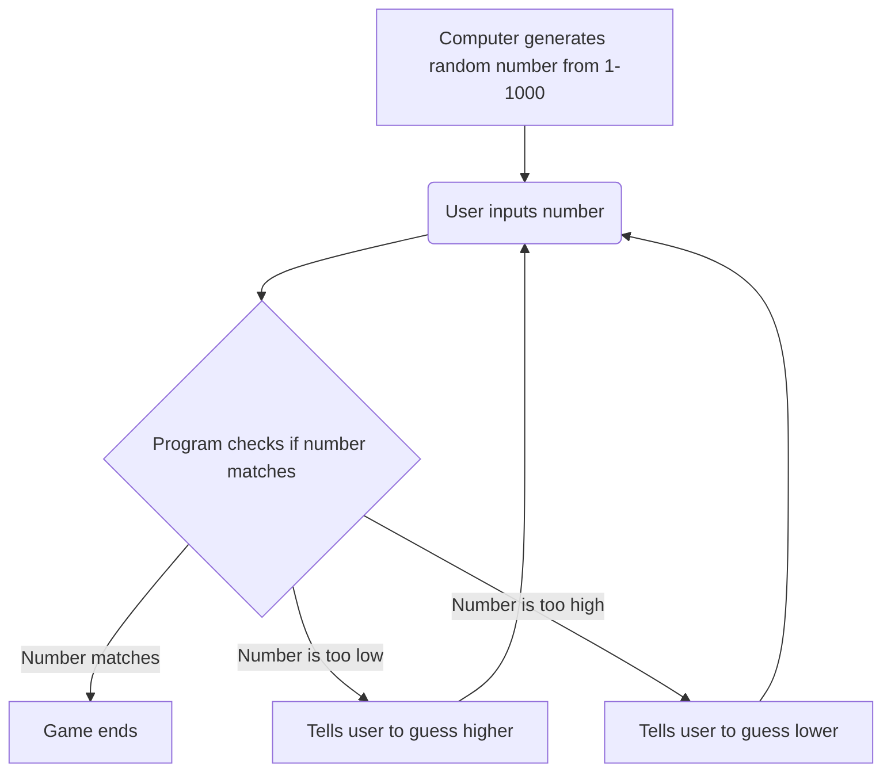

```mermaid
flowchart TD
    A[Computer generates random number from 1-1000] --> B(User inputs number)
    B --> C{Program checks if number matches}
    C -->|Number matches| D[Game ends]
    C -->|Number is too low| E[Tells user to guess higher]
    C -->|Number is too high| F[Tells user to guess lower]
    E --> B
    F --> B
```